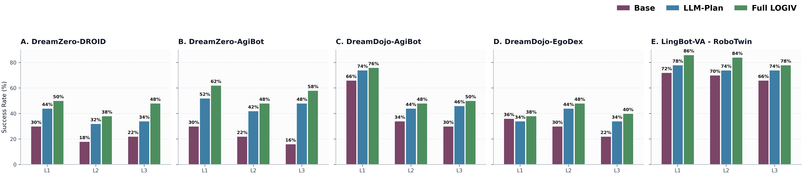

# 4. 实验

## A. 评测协议与实现细节

我们在四个公开来源上组织评测。评测基准来自 Khazatsky 等人在 RSS 2024 发布的 DROID、Bu 等人在 2025 年发布的 AgiBot World、Hoque 等人在 2025 年发布的 EgoDex，以及 Chen 等人在 2025 年发布的 RoboTwin 2.0。对于 RoboTwin 2.0，我们评估 Li 等人在 2026 年提出的 LingBot-VA。DROID 的公开发布版本没有给出与另外两个数据集完全同构的冻结公开评测划分，因此我们从其官方 RLDS 发布中构造确定性的评测子集。AgiBot 和 EgoDex 直接采用各自公开的评测池。RoboTwin 2.0 采用已经完成的 300 条 LingBot-VA 评测结果中固定导出的 top50x3 子集，L1、L2 和 L3 各 50 条。以上所有评测名单都在实验前固定，不根据最终结果再做筛选。

在 DROID、AgiBot 和 EgoDex 内部，我们首先构建干净候选池。DROID 只保留 `success=True`、轨迹长度不少于 10 步且传感器文件完整的 episode。AgiBot 和 EgoDex 的公开评测文件没有统一提供显式的 success 或 reward 标签，因此只保留结构有效、传感器完整且轨迹长度不少于 10 步的 episode。随后，我们用轨迹执行视界 $H$ 作为复杂度代理，在每个数据集内部计算 $H$ 的 33% 和 66% 分位数，并据此把候选轨迹划分为 L1、L2 和 L3 三个复杂度层级。最终，我们使用固定随机种子 `Seed=42` 进行确定性抽样。每个数据集抽取 150 条评测轨迹，L1、L2 和 L3 各 50 条。在每个层级内部，我们再基于任务语义分组执行轮询式采样，从而避免测试集退化为少数高频任务的重复采样。RoboTwin 2.0 直接使用前述固定导出的 150 条子集，不再额外执行候选筛选和重新抽样。

为了刻画各复杂度层级对应的时序跨度，我们进一步统计平均 episode 持续时间，也即 Mean Elapsed Time。对于提供原生时间戳的轨迹，episode 持续时间定义为 $T=t_{N-1}-t_0$。对于未公开逐步时间戳但采样频率稳定的数据，则采用

$$
T=(H-1)/f
$$

作为持续时间代理。结果见表 1。可以看到，不同数据集内部从 L1 到 L3 都呈现稳定的时序跨度增长，这为后续分析方法在长时程任务上的收益提供了统一且可复现的评测基础。

任务性能通过四项指标衡量。我们报告 Success Rate、Mean L2、Task Progress 和动作误差低于 0.1 的采样比例。Success Rate 越高越好，Mean L2 越低越好，Task Progress 越高越好，动作误差低于 0.1 的采样比例同样越高越好。任务是否成功由头戴视角 RGB 视频中的最终视觉状态判定，评估时同时参考初始画面、人工示范终态和模型生成轨迹终态。基线执行器采用 Ye 等人在 2026 年提出的 DreamZero、Gao 等人在 2026 年提出的 DreamDojo，以及 Li 等人在 2026 年提出的 LingBot-VA。

**表 1** 各数据集不同复杂度层级的平均 episode 持续时间

| Dataset | Mean Elapsed Time in seconds for L1 / L2 / L3 |
| ------- | ---------------------------------------------- |
| DROID   | 7.65 / 13.56 / 25.05                           |
| AgiBot  | 4.57 / 6.55 / 11.00                            |
| EgoDex  | 3.71 / 12.22 / 37.47                           |

## B. 主实验：跨基座适配性

为避免主结果与组件消融相互混杂，本节仅比较未修改的原始基座模型与完整方法。为提高可读性，后续主结果表格中将未修改基座统一记为 **Base**，将包含动态阶段条件与验证式自纠错的完整系统统一记为 **Ours**；消融部分再回到 `llm_dual`、`llm_self`、`llm_val` 等内部实现名称。

主实验采用四项互补指标。Success Rate 衡量 episode 级任务是否完成；Mean L2 计算对齐采样时刻下预测动作与真实动作之间的平均 L2 欧氏距离，用于反映低层动作误差；Task Progress 是依据初始帧、真实终帧和模型终帧给出的连续评分，用于刻画未完全成功时对目标状态的接近程度；$L2<0.1$ 则统计动作空间误差低于阈值 0.1 的采样比例，用于反映逐步动作对齐精度。对于 DROID、AgiBot、EgoDex 和 RoboTwin 2.0，每个复杂度层级均包含 50 条轨迹，OA 表示 L1、L2、L3 三个 split 的算术平均。LingBot-VA 对应的 RoboTwin 2.0 评测集采用固定导出的 top50x3 子集。

在此基础上，表 2 至表 5 分别从成功率、动作误差、任务完成进度和阈值精度四个角度报告主实验结果。这样的拆分式写法虽然占用更多版面，但能够让读者清晰区分“最终是否完成任务”和“中间动作是否更接近专家轨迹”这两类性质不同的指标。

**表 2** 主实验成功率对比（单位：%）

| Backbone | Benchmark | L1 Base | L1 Ours | L2 Base | L2 Ours | L3 Base | L3 Ours | OA Base | OA Ours | ΔOA |
| -------- | --------- | ------- | ------- | ------- | ------- | ------- | ------- | ------- | ------- | --- |
| DreamZero | DROID      | 30.0 | 50.0 | 18.0 | 38.0 | 22.0 | 48.0 | 23.3 | 45.3 | +22.0 |
| DreamZero | AgiBot     | 30.0 | 62.0 | 22.0 | 48.0 | 16.0 | 58.0 | 22.7 | 56.0 | +33.3 |
| DreamDojo | AgiBot     | 66.0 | 76.0 | 34.0 | 48.0 | 30.0 | 50.0 | 43.3 | 58.0 | +14.7 |
| DreamDojo | EgoDex     | 36.0 | 38.0 | 30.0 | 48.0 | 22.0 | 40.0 | 29.3 | 42.0 | +12.7 |
| LingBot-VA | RoboTwin 2.0 | 72.0 | 86.0 | 70.0 | 84.0 | 66.0 | 78.0 | 69.3 | 82.7 | +13.3 |

**表 3** 主实验 Mean L2 对比（越低越好）

| Backbone | Benchmark | L1 Base | L1 Ours | L2 Base | L2 Ours | L3 Base | L3 Ours | OA Base | OA Ours | OA 降幅 |
| -------- | --------- | ------- | ------- | ------- | ------- | ------- | ------- | ------- | ------- | ------- |
| DreamZero | DROID      | 0.1291 | 0.1075 | 0.1255 | 0.1032 | 0.1389 | 0.1071 | 0.1312 | 0.1059 | 0.0253 |
| DreamZero | AgiBot     | 0.0845 | 0.0672 | 0.0942 | 0.0704 | 0.0748 | 0.0593 | 0.0845 | 0.0656 | 0.0189 |
| DreamDojo | AgiBot     | 0.1149 | 0.1103 | 0.1827 | 0.1602 | 0.1341 | 0.1012 | 0.1439 | 0.1239 | 0.0200 |
| DreamDojo | EgoDex     | 0.0974 | 0.0792 | 0.1057 | 0.0810 | 0.0987 | 0.0820 | 0.1006 | 0.0807 | 0.0199 |
| LingBot-VA | RoboTwin 2.0 | 0.6604 | 0.6285 | 0.6518 | 0.6234 | 0.6386 | 0.6127 | 0.6503 | 0.6215 | 0.0288 |

**表 4** 主实验 Task Progress 对比（越高越好）

| Backbone | Benchmark | L1 Base | L1 Ours | L2 Base | L2 Ours | L3 Base | L3 Ours | OA Base | OA Ours | OA 提升 |
| -------- | --------- | ------- | ------- | ------- | ------- | ------- | ------- | ------- | ------- | ------- |
| DreamZero | DROID      | 0.4920 | 0.5740 | 0.4200 | 0.5240 | 0.4340 | 0.5380 | 0.4487 | 0.5453 | 0.0966 |
| DreamZero | AgiBot     | 0.4600 | 0.6240 | 0.4160 | 0.5420 | 0.4060 | 0.5840 | 0.4273 | 0.5833 | 0.1560 |
| DreamDojo | AgiBot     | 0.6080 | 0.6820 | 0.3820 | 0.5720 | 0.3100 | 0.4560 | 0.4333 | 0.5700 | 0.1367 |
| DreamDojo | EgoDex     | 0.4460 | 0.4720 | 0.4120 | 0.5960 | 0.4320 | 0.5920 | 0.4300 | 0.5533 | 0.1233 |
| LingBot-VA | RoboTwin 2.0 | 0.6858 | 0.7960 | 0.6818 | 0.7898 | 0.6546 | 0.7298 | 0.6741 | 0.7719 | 0.0978 |

**表 5** 主实验阈值精度比例 $L2<0.1$ 对比（单位：%）

| Backbone | Benchmark | L1 Base | L1 Ours | L2 Base | L2 Ours | L3 Base | L3 Ours | OA Base | OA Ours | ΔOA |
| -------- | --------- | ------- | ------- | ------- | ------- | ------- | ------- | ------- | ------- | --- |
| DreamZero | DROID      | 48.7 | 66.0 | 52.0 | 62.7 | 48.0 | 58.0 | 49.6 | 62.2 | +12.7 |
| DreamZero | AgiBot     | 72.0 | 89.3 | 52.0 | 80.0 | 77.3 | 96.7 | 67.1 | 88.7 | +21.6 |
| DreamDojo | AgiBot     | 34.0 | 39.0 | 24.0 | 26.0 | 32.0 | 38.0 | 30.0 | 34.3 | +4.3 |
| DreamDojo | EgoDex     | 65.0 | 86.0 | 61.0 | 71.0 | 62.0 | 70.0 | 62.7 | 75.7 | +13.0 |
| LingBot-VA | RoboTwin 2.0 | 14.8 | 15.1 | 14.7 | 14.5 | 19.4 | 20.1 | 17.1 | 17.5 | +0.4 |

LingBot-VA 的 Success Rate、Mean L2 和 Task Progress 直接由固定导出的 shortlist 统计表获得；表 5 中的 $L2<0.1$ 则依据同一 shortlist 的 `source_uid` 回连原始评测日志，并按原始结果一致的统计口径，即 $\sum \texttt{num\_step\_pass\_l2\_lt\_0\_1} / \sum \texttt{compared\_steps}$ 进行聚合得到。

从表 2 可以看到，Ours 在五个“基座-基准”组合上均提升了 Success Rate，OA 提升范围为 12.7 到 33.3 个百分点，其中 DreamZero-AgiBot 的增益最大。表 3 进一步表明，这种收益并非只体现在最终成败上，Ours 在全部五个组合上都降低了 Mean L2，说明预测动作与真实动作的几何偏差整体更小。表 4 显示，Task Progress 在五个组合上也全部提高，说明即使在未完全成功的案例中，完整方法仍更接近目标终态。表 5 则补充了一个更细粒度的观察：在 DROID、AgiBot、EgoDex 和 RoboTwin 2.0 上，Ours 的 $L2<0.1$ 整体上均有所提升；其中 LingBot-VA 上的提升幅度相对更小，并未像 Success Rate 和 Task Progress 那样同步放大。

这一结果说明，本文方法带来的主要收益首先体现在高层阶段目标的稳定追踪和最终任务完成上，其次才表现为逐步动作对齐误差的变化。换言之，Success Rate、Mean L2 与 Task Progress 的一致改善支持了本文“优化高层推理接口而非修改底层执行器”的核心观点；而 LingBot-VA 上相对平缓的 $L2<0.1$ 变化也进一步表明，不同基座对“阶段引导增强”和“逐步模仿精度”的敏感性并不完全相同。

## C. 消融实验

### C1. 仅引入 LLM 阶段规划的效果

为了单独评估“动态阶段条件”这一接口设计本身的贡献，我们首先比较 Base 与仅加入 LLM 规划、但不带验证式纠错的版本。为避免与主实验中的 Ours 混淆，本小节将 `llm_dual` 记为 **LLM-Plan**。表 6 可以看出，单独加入 LLM 阶段规划后，五个组合的 Overall Success Rate 均有提升，增幅为 6.0 至 24.6 个百分点。这说明即使不引入后续纠错，仅将静态全局指令拆解为可执行的阶段性子目标，也已经能够显著缓解长时程任务中的阶段混淆问题。

**表 6** 仅加入 LLM 阶段规划时的跨基座消融结果（单位：%）

| Backbone | Benchmark | L1 Base | L1 LLM-Plan | L2 Base | L2 LLM-Plan | L3 Base | L3 LLM-Plan | OA Base | OA LLM-Plan | ΔOA |
| -------- | --------- | ------- | ----------- | ------- | ----------- | ------- | ----------- | ------- | ----------- | --- |
| DreamZero | DROID      | 30.0 | 44.0 | 18.0 | 32.0 | 22.0 | 34.0 | 23.3 | 36.7 | +13.4 |
| DreamZero | AgiBot     | 30.0 | 52.0 | 22.0 | 42.0 | 16.0 | 48.0 | 22.7 | 47.3 | +24.6 |
| DreamDojo | AgiBot     | 66.0 | 74.0 | 34.0 | 44.0 | 30.0 | 46.0 | 43.3 | 54.7 | +11.4 |
| DreamDojo | EgoDex     | 36.0 | 34.0 | 30.0 | 44.0 | 22.0 | 34.0 | 29.3 | 37.3 | +8.0 |
| LingBot-VA | RoboTwin 2.0 | 72.0 | 78.0 | 70.0 | 74.0 | 66.0 | 74.0 | 69.3 | 75.3 | +6.0 |

为了更直观地展示不同模块的叠加效应，图 1 以 `1×5` 横向排布给出了包含 LingBot-VA 在内的五个“基座-基准”组合在三个复杂度层级上的成功率柱状图，并将共享图例统一放在右上角。从图中可以直接看到，LLM-Plan 相较 Base 在大多数设置上已经形成稳定提升，而 Ours 进一步在长时程 split 上继续扩大优势，例如 DreamZero-DROID 的 L3 从 34% 提升到 48%，DreamZero-AgiBot 的 L3 从 48% 提升到 58%，LingBot-VA 的 L3 从 74% 提升到 78%。这说明验证式纠错带来的附加收益主要出现在更容易产生阶段偏离的复杂序列中。

**图 1** 五个“基座-基准”组合在三个复杂度层级上的成功率对比。紫色为 Base，蓝色为 LLM-Plan，绿色为 Full LOGIV（Ours）；图例统一置于右上角。LingBot-VA 基于 RoboTwin 2.0 的固定 top50x3 评测子集。

### C2. 不同纠错策略的效果

进一步地，我们直接比较三种高层规划纠错策略：无纠错（`llm_raw`）、LLM 自纠错（`llm_self`）和基于验证器的纠错（`llm_val`）。为提高表述清晰度，表 7 分别记为 **Raw Plan**、**LLM Self-Refine** 和 **VAL-Corrected**。这里的实验不引入额外执行器差异，而是直接衡量高层计划的逻辑正确性。

**表 7** 不同纠错策略在各数据集上的逻辑正确性对比

| Dataset | Raw Plan | LLM Self-Refine | VAL-Corrected |
| ------- | -------- | --------------- | ------------- |
| DROID   | 38.33%   | 74.00%          | 99.67%        |
| AgiBot  | 67.50%   | 87.67%          | 100.00%       |
| EgoDex  | 92.00%   | 95.60%          | 99.10%        |

表 7 表明，LLM 自纠错相较于无纠错确实能显著改善规划逻辑，但仍会保留部分未修复错误；相比之下，VAL-Corrected 在三个数据集上都达到接近饱和的逻辑正确率，说明“生成-验证-修复”的闭环能够更稳定地修正步骤遗漏、顺序错误以及前置条件不满足等问题。这也解释了为什么 Ours 能在表 2 至表 5 的主结果中持续优于仅有阶段规划的 LLM-Plan。

对于 LingBot-VA，我们当前保存的是固定 `top50x3` shortlist 的 150 条真实运行日志，而不是与 DROID、AgiBot、EgoDex 完全同口径的离线 planner-validity 标注集，因此不直接把它并入表 7 的逻辑正确率统计。若采用与运行结果一一对应的 task-level 经验证据，RoboTwin 2.0 上 Raw Plan、LLM Self-Refine 和 VAL-Corrected 分别达到 69.33% (`104/150`)、75.33% (`113/150`) 和 82.67% (`124/150`)；按 split 细分，L1 为 `72/78/86%`，L2 为 `70/74/84%`，L3 为 `66/74/78%`。这说明在 LingBot-VA 上，即使不引入新的低层执行器，验证式纠错依然能在真实 rollout 日志层面带来稳定收益。

进一步看这 150 条日志内部的三类 case，`strict_monotonic`、`val_top_only` 和 `dual_mid_only` 分别占 `32.0%`、`23.3%` 和 `44.7%`。其中，`strict_monotonic` 子集上的成功率呈现 `60.4 -> 77.1 -> 83.3%` 的单调上升；`val_top_only` 子集则呈现 `65.7 -> 54.3 -> 82.9%`，说明盲目自纠错有时会把原本尚可执行的计划改坏，而验证器能够把它重新拉回到更可执行的结构；`dual_mid_only` 子集为 `77.6 -> 85.1 -> 82.1%`，表明自纠错本身已经能覆盖一大类阶段分解错误，但在 150 条日志的整体统计上，VAL-Corrected 仍给出最高的 overall 成功率。更细粒度地看，VAL 额外救回了 `13` 条自纠错仍失败的样本，其中 `9` 条属于只有 VAL 能成功的纯救援案例。

## D. 推理开销分析

除了性能指标外，我们还评估了方法的时间开销。这里需要强调，本文方法的高层规划并不是在执行过程中反复插入的额外等待，而是在每条轨迹开始前进行一次性的“思考”或任务分解；一旦规划完成，后续闭环控制仍由底层策略连续输出动作序列，因此不会在执行过程中持续打断控制流。换言之，时间开销应更自然地拆分为“启动阶段延迟”和“闭环执行阶段延迟”两部分。

记 $K$ 为真实闭环执行中底层策略的实际查询次数。由于执行器每次调用会输出一段可连续执行的动作序列，而非仅输出单步动作，因此以 $K$ 而非原始时间步统计推理开销更贴近真实部署。对于长度为 $N$ 的轨迹，若单次策略调用平均覆盖 $h$ 步动作，则有 $K\approx \lceil N/h \rceil$。在这一设定下，总推理耗时可近似写为

$$
T_{\mathrm{total}} \approx K \cdot T_{\mathrm{policy}} + T_{\mathrm{plan}}.
$$

其中，$T_{\mathrm{plan}}$ 表示轨迹开始前的一次性规划时间，可理解为系统在执行前先进行 2-3 秒左右的任务思考；$K \cdot T_{\mathrm{policy}}$ 表示规划完成后的闭环执行时间，它决定了后续 rollout 阶段的实际控制流畅度。从部署角度看，真正影响执行阶段实时性的主要是 $T_{\mathrm{policy}}$，而不是一次性的 $T_{\mathrm{plan}}$。因此，表 8 的结果不应理解为系统在整段执行过程中持续承受额外等待，而应理解为：系统在任务开始前先完成一次高层规划，随后便以与原始执行器相同的闭环模式连续运行。

表 8 给出了不同复杂度层级上的总推理时间与规划时间。可以看到，Ours 的规划时间基本稳定在 2.3-3.8 s，而总推理时间随 $K$ 增长而上升。也就是说，随着任务变长，增加的是闭环执行阶段的时长，而不是高层规划阶段的等待；规划时间始终表现为任务开始前的一次性启动延迟。例如，在 DreamZero-DROID 上，L1、L2、L3 的规划时间分别为 2.308、2.360 和 2.466 s，变化很小；在 DreamZero-AgiBot 上，这一数值分别为 3.789、3.577 和 3.507 s，同样保持稳定。这说明本文方法引入的是一个固定且可预期的前置思考过程，而不会破坏后续推理阶段的流畅性。

对于 LingBot-VA / RoboTwin 2.0，同一套 `top50x3` 真实运行日志直接保留了 `num_chunks`、`compared_steps` 和 `plan_time`，但没有统一导出的 wall-clock `Time for Total Inference (s)` 字段，因此我们只报告可直接核对的 planning overhead 与执行视界代理。按 L1、L2、L3 划分，平均 `K=num_chunks` 分别为 `4.34`、`5.90` 和 `10.54`，对应的 `llm_val` 规划时间分别为 `3.380`、`4.108` 和 `4.440 s`；若看 `dual_llm`，则分别为 `1.716`、`1.959` 和 `1.668 s`。这说明 LingBot-VA 上同样是执行视界随难度明显增长，而高层规划时间仍维持在约 `3-4.5 s` 的一次性启动开销量级。

**表 8** 各数据集不同复杂度层级的推理时间消耗对比

| Dataset           | Split | n   | K   | Time for Total Inference (s) | llm_val $T_{\text{plan}}$ (s) |
| ----------------- | ----- | --- | --- | ---------------------------- | ----------------------------- |
| DreamZero-DROID   | L1    | 50  | 5   | 10.66                        | 2.308                         |
| DreamZero-DROID   | L2    | 50  | 7   | 14.93                        | 2.360                         |
| DreamZero-DROID   | L3    | 50  | 10  | 21.33                        | 2.466                         |
| DreamZero-AgiBot  | L1    | 50  | 24  | 52.25                        | 3.789                         |
| DreamZero-AgiBot  | L2    | 50  | 33  | 71.84                        | 3.577                         |
| DreamZero-AgiBot  | L3    | 50  | 55  | 119.74                       | 3.507                         |
