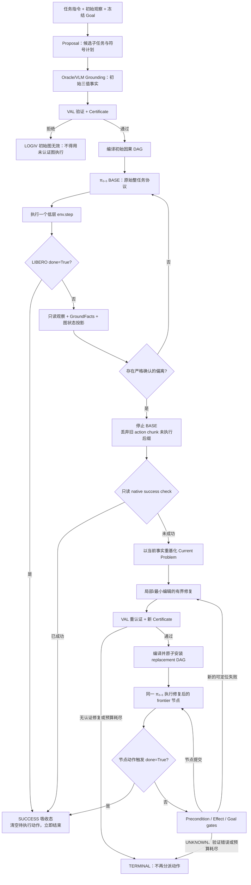
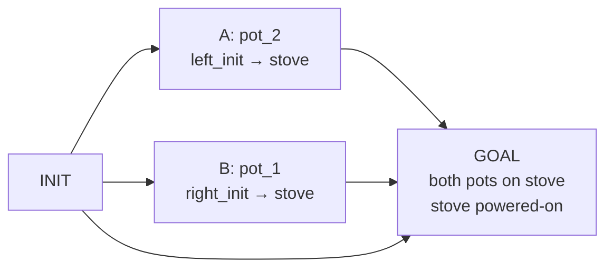
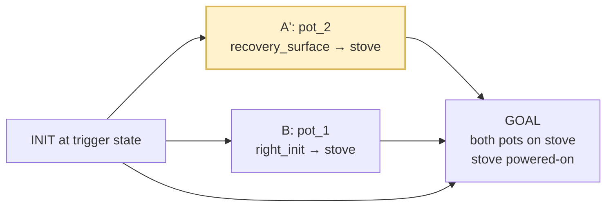

# LOGIV 方法论：初始认证任务图、在线监控与失败触发的局部图修复

**文档日期：** 2026-08-09  
**适用实现：** `LOGIV_ONLINE` + 冻结的 π₀.₅ LIBERO policy  
**当前实验实例：** Scripted Proposal + Oracle Grounding + VAL + Causal DAG  
**一句话定义：** LOGIV 是包在冻结 BASE policy 外部的“初始规划、在线状态解释、可验证失败检测和认证图修复”控制层；没有证据表明 BASE 偏离时，它不改变 BASE，只有在偏离被严格确认后才接管剩余执行。

---

## 1. 结论先行：用户给出的理解是否正确？

是的，LOGIV 的核心闭环就是：

> **初始规划 + 在线监控 + 失败触发的认证图修复层。**

更精确地说，完整方法包含以下八个环节：

1. 根据任务、初始观察和冻结目标生成候选高层子任务。
2. 将子任务转换为符号计划，使用真实 VAL 验证，并编译为带证书的因果 DAG。
3. 让 π₀.₅ BASE 按原始整任务 prompt、原始动作分块和原始随机协议执行。
4. 旁路观察每个执行步，把实际状态投影到 DAG 的节点状态上。
5. 没有严格确认的偏离时，LOGIV 不修改 BASE 的 prompt、动作、推理请求或终止逻辑。
6. 出现可验证偏离时，停止执行旧动作块的未执行后缀，以当前状态重建 Current Problem，并在固定动作集合内有界修复计划。
7. 新计划必须重新通过 VAL，编译为新的 DAG 版本并原子安装，随后继续使用同一个 π₀.₅ policy 完成修复后的节点。
8. LIBERO 原生 `done=True` 是吸收成功态：立即停止，之后不能再执行动作，也不能被符号检查重新判成失败。

这里有两个必须说明的限定：

- “VLM 持续观察”是方法层的抽象接口。当前 10×100 实验没有在运行时调用外部 VLM API，而是使用版本化的 scripted proposal，并用 LIBERO oracle grounding 产生在线事实。因此当前结果验证的是 LOGIV 控制闭环，而不是真实 VLM 感知能力。
- 在线首次接管不是直接原地修改旧 DAG。当前工程实现先将任务重基化到当前事实，再生成、验证并原子安装一个 replacement DAG。这样能够保证新图拥有自己的 VAL 证书，旧证书不会错误地授权新动作。

---

## 2. LOGIV 要解决的根本问题

冻结的视觉—语言—动作 policy 可以直接根据整任务指令产生低层动作，但它通常缺少三种能力：

1. **显式任务结构。** Policy 不显式保存“哪些子目标已经完成、哪些子目标依赖哪些前置条件”。
2. **可验证的执行进度。** Policy 可能持续输出看似合理的动作，却没有让目标事实发生变化。
3. **局部失败恢复。** 当一个物体掉落、放错位置或某个分支卡住时，整任务 policy 往往重复原行为，或破坏已经完成的部分。

LOGIV 不尝试替换 π₀.₅，也不训练第二个 recovery policy。它将 π₀.₅ 视为动作生成器，在外部增加一个具有显式任务图、状态跟踪、验证和修复能力的控制层。

因此，两者的职责被清楚分开：

| 组件 | 主要职责 | 不负责什么 |
| --- | --- | --- |
| π₀.₅ BASE | 根据语言和图像生成连续低层动作 | 不负责证明计划正确，也不负责维护显式 DAG |
| LOGIV | 规划、验证、监控、判断是否偏离以及认证修复 | 不修改冻结 checkpoint，不在正常执行时替 BASE 决策 |
| LIBERO | 执行动作并给出原生终止信号 | 不提供高层修复计划 |

这形成一个“快执行、慢监督”的分层系统：BASE 负责大部分动作，LOGIV 仅在有强证据时进入控制路径。

---

## 3. 形式化表示

### 3.1 任务与事实状态

一个任务写为：

\[
\mathcal{T}=(\mathcal{O}, S_0, G^+, G^-, \mathcal{A}),
\]

其中：

- \(\mathcal{O}\) 是注册对象、区域、容器、开关和访问部件；
- \(S_0\) 是初始事实状态；
- \(G^+\) 是必须为真的目标事实；
- \(G^-\) 是必须为假的目标事实；
- \(\mathcal{A}\) 是固定 Domain 中允许使用的 grounded action 集合。

在线事实采用三值语义：

\[
\operatorname{truth}(f)\in\{\text{TRUE},\text{FALSE},\text{UNKNOWN}\}.
\]

`UNKNOWN` 不能满足正前置条件，也不能满足负前置条件，更不能单独授权修复。这样可以防止“没有看到”被误当成“确认不存在”。

### 3.2 高层动作

高层动作具有前置条件和效果：

\[
a=(\operatorname{Pre}^+(a),\operatorname{Pre}^-(a),
   \operatorname{Eff}^+(a),\operatorname{Eff}^-(a)).
\]

例如：

```text
(place-on moka_pot_2
          kitchen_table_recovery_surface
          flat_stove_1_cook_region)
```

表示从当前恢复表面重新拿起 `moka_pot_2`，并把它放到炉子的目标区域。固定 Domain 限制 LOGIV 能使用的动作 schema；proposal 或修复器不能临时发明未注册动作。

### 3.3 因果 DAG

经过 VAL 认证的计划被编译为：

\[
\mathcal{D}=(V,E,C,H),
\]

其中：

- \(V\) 包含虚拟 `INIT`、动作 occurrence 节点和虚拟 `GOAL`；
- \(E\) 只包含真实 causal-support 或 conflict-protection 边；
- \(C\) 是绑定 Domain、Problem、Plan、VAL 和上下文哈希的证书；
- \(H\) 是 graph hash/version，用于防止旧回调或旧证书控制新图。

DAG 不是简单复制线性计划。两个互不依赖的目标分支可以同时处于 `READY`，而单臂机器人仍按稳定的 canonical agenda 一次执行一个节点。

### 3.4 节点在线状态

在线图投影器把每个节点标记为：

- `READY`：前驱满足，可以执行；
- `ACTIVE`：动作相关状态已经开始变化；
- `EFFECT_OBSERVED`：观察到效果，但尚未达到稳定确认条件；
- `COMPLETED`：效果被事实证据确认；
- `BLOCKED`：前置条件或上游依赖尚未满足。

LOGIV 因而不仅知道“执行了多少步”，还知道“任务图的哪一部分真正取得了进展”。

---

## 4. 方法模块

| 模块 | 输入 | 核心操作 | 输出 | 设计目的 |
| --- | --- | --- | --- | --- |
| Proposal | 任务、初始图像、冻结目标 | 生成候选子任务和符号动作 | Candidate Problem/Plan | 把自然语言任务变成可验证结构 |
| Grounding | 当前观察、注册对象 | 产生 TRUE/FALSE/UNKNOWN facts | FactSnapshot | 把物理状态连接到符号图 |
| VAL + DAG Compiler | Problem、Plan、Domain | 验证计划并编译因果依赖 | Certificate + DAG | 禁止未验证计划进入执行 |
| BASE Executor | 整任务 prompt、当前图像 | 按原协议调用 π₀.₅ | 低层动作流 | 保留 BASE 原始能力和公平对照 |
| Graph Tracker | FactSnapshot、DAG | 更新节点状态和已实现目标 | Graph State | 解释实际进度而不改变控制 |
| Deviation Detector | 连续图状态、严格快照 | 稳定候选 + 严格确认 | OnlineRepairRequest | 只在强证据下接管 |
| Repair Operator | Current Problem、原目标、剩余计划 | 有界搜索、最小编辑、VAL | Certified Replacement Plan | 修复受影响部分并保护已完成目标 |
| Closed-loop Controller | 新 DAG、节点 prompt、π₀.₅ | 前置/效果/目标门控执行 | Success 或安全终止 | 让修复后的计划形成闭环 |

---

## 5. 完整执行闭环

### 5.1 阶段 A：任务开始时生成并验证初始 DAG

在第一个 BASE policy request 之前，LOGIV 完成以下步骤：

1. 冻结任务目标，生成稳定的 `goal_id` 和 `goal_epoch`。
2. Proposal 模块生成候选 grounded subtasks。
3. Grounding 模块读取初始观察，产生 epoch 0 的事实快照。
4. 检查 proposal 中的初始 TRUE/FALSE facts 是否与真实 grounding 冲突。
5. 将事实和目标写成 Current Problem，并把候选子任务写成 candidate plan。
6. Repair Operator 可以在固定动作集合中对候选计划做有界的最小修正。
7. 真实 VAL 验证完整计划；超时、崩溃、解析错误都不能被当成“验证通过”。
8. DAG Compiler 检查证书哈希，构建 causal-support 和 conflict-protection 边。
9. 保存初始 graph hash、certificate hash、canonical agenda 和 proposal provenance。

只有通过上述流程的图才是“可执行任务图”。符号计划正确不代表低层执行必然成功，但它至少证明：在声明的抽象 Domain 中，计划从初始事实出发能够满足目标。

当前 `LOGIV_ONLINE` evaluator 对初始图采用严格 guard：若初始 proposal/DAG 未认证，LOGIV episode 会被标记为无效，而不会使用未认证图继续。部署版本也可以选择显式 fail-open 到纯 BASE，但必须把该降级状态写入记录，不能仍宣称该 episode 使用了 LOGIV 图监控。

### 5.2 阶段 B：BASE 按原协议执行

初始 DAG 准备好以后，π₀.₅ 仍然接收原始 LIBERO 整任务指令，而不是一开始就接收拆分节点 prompt。

BASE 路径保持不变：

- 相同的冻结 checkpoint；
- 相同的整任务语言 prompt；
- 相同的图像预处理；
- 相同的每 5 个低层动作重新规划协议；
- 相同的 episode seed 和推理 request envelope；
- 相同的 520 低层动作上限。

LOGIV 在这一阶段是旁路观察者。它不能修改 BASE 已经生成的动作，不能额外插入动作，也不能因为图上的弱异常而改变 prompt。

在第一次认证接管之前，应满足前缀不变量：

\[
a^{\text{LOGIV}}_{1:t}=a^{\text{BASE}}_{1:t},\qquad
q^{\text{LOGIV}}_{1:k}=q^{\text{BASE}}_{1:k},
\]

其中 \(a\) 是低层动作，\(q\) 是 policy inference request。该不变量是“未发现失败时不改变 BASE”的可测试定义。

### 5.3 阶段 C：在线观察与任务图投影

每个低层 `env.step` 返回后，LOGIV 都会收到只读观察副本和 BASE provenance。当前实现每一步更新轨迹和图投影，通常每 5 步进行一次偏离判定。

在线监控依次执行：

1. 验证 policy step 连续、request index 单调、动作块后缀形状正确。
2. 更新 BASE 已执行动作前缀的 SHA-256，保证监控没有偷换动作历史。
3. 对当前观察进行 grounding，得到新的 FactSnapshot。
4. 将事实投影到初始 DAG，更新 `READY/ACTIVE/COMPLETED/BLOCKED`。
5. 记录已经实现过的正、负目标事实。
6. 计算偏离候选；若没有强候选，立即返回 BASE。

监控代码保存并恢复 Python/NumPy RNG 状态。监控出错时记录 error，但默认 fail-open，让 BASE 继续；监控错误本身不授权控制接管。

### 5.4 阶段 D：严格偏离检测

当前在线检测器有三类控制触发：

#### 1. `GOAL_REGRESSION`

某个目标事实过去已经被确认满足，但后来被观察为可靠的相反值。

例如，杯子已经在盘子中，后来又被碰出盘子。只有“先确认完成、再确认回退”才算 regression；从未确认过的目标不能产生回退事件。

#### 2. `UNPLANNED_RECOVERY_SURFACE`

注册对象被稳定地观察在一个既不是初始位置、也不是目标位置的 recovery surface。

例如，一个 moka pot 从抓取或放置过程中掉回桌面恢复区域。某些任务可以额外要求已经完成至少一个目标事实，避免把正常早期移动误判为恢复事件。

#### 3. `FRONTIER_STALL`

当前活动图前沿在规定窗口内没有变化，并且严格快照确认：

- 仍有 `READY/ACTIVE` 动作节点；
- 整体目标尚未满足；
- 前沿动作的声明效果仍为 false，而不是 unknown；
- 任务级安全条件成立，例如明确 `handempty` 或已有目标进展。

stall 使用“图进度签名”，而不仅是机械地数时间。签名可以包含已完成节点、已实现目标和持物状态；状态真的变化时，stall 计时会重新开始。

### 5.5 两层证据：候选观察与严格确认

一次异常观察不能立即触发修复。检测过程分两层：

1. **连续候选确认。** 相同的偏离类型和相同 signature 必须连续出现配置次数。
2. **严格重观察。** 达到次数后，系统调用 strict snapshot reader 重新读取状态，并再次验证同一个偏离。

若 strict reader 失败、事实变成 `UNKNOWN`、signature 改变或严格快照不支持候选，候选计数被清零，BASE 继续执行。

触发请求包含：

```text
kind
policy_step
first_observed_step
signature
strict snapshot evidence hash
source graph hash
request hash
```

请求只锁存第一次认证偏离。过时 graph hash、stale certificate、单帧异常或 `UNKNOWN` 永远不能单独触发。

### 5.6 阶段 E：从 BASE 安全交接给修复控制器

偏离被确认后，交接遵循严格顺序：

1. 当前 `env.step` 已经同步返回。
2. 再次检查该步是否返回 `done=True`；若是，直接成功，不进入修复。
3. 清空当前 π₀.₅ action chunk 中尚未执行的动作，并记录 `discarded_pending_actions`。
4. 停止 BASE 主循环，不运行 settling 动作。
5. 用 LIBERO 原生 `check_success()` 做一次只读检查；若任务事实上已成功，则进入吸收成功态。
6. 若任务未成功，保存 handoff observation、BASE prefix steps、request count、动作前缀哈希和偏离证据。

这里丢弃的是“已经生成但尚未执行”的旧动作后缀，而不是回滚已经执行的动作。旧后缀是在偏离发生前生成的，继续执行可能扩大错误，因此它不再具有控制授权。

### 5.7 阶段 F：构造 Current Problem

修复不再使用任务开始时的 \(S_0\)，而是使用触发时的严格事实状态 \(S_t\)：

\[
\mathcal{T}_t=(\mathcal{O},S_t,G^+,G^-,\mathcal{A}).
\]

关键原则是：

- 目标 \((G^+,G^-)\) 不变；
- 当前对象位置、持物状态、开关状态和容器状态来自新快照；
- 已经满足的目标应被保护，而不是无条件重做；
- 失败 occurrence 没有 effect receipt 时不能被假装成已完成；
- 修复只能使用 coverage manifest 允许的固定 schema。

首次 BASE→LOGIV 交接时，当前实现通过 `recovery_state=True` 将 scripted proposal 重基化到 \(S_t\)，然后对 nominal plan 做有界、最小编辑优先的重新认证。进入修复控制器以后，后续的 precondition/effect/goal failure 会进一步构造明确 obligation 和 causal slice，实现拓扑局部修复。

### 5.8 阶段 G：有界局部修复

Repair Operator 在固定 grounded action catalog 中搜索候选路径。候选优先级依次考虑：

1. 是否破坏触发时已经满足的目标；
2. 与原 remaining plan 的编辑距离；
3. 新计划长度；
4. 旧 DAG 中的 canonical rank；
5. grounded action 的确定性字典序。

因此修复倾向于最小变化，而不是从头重新规划。它能够实现：

| 失败类型 | 可能的图修复 |
| --- | --- |
| 物体掉到新表面 | 把 placement 节点的 source location 重绑定到 recovery surface |
| 前置 access 关闭 | 插入 `open-access`，再执行原放置节点 |
| 目标分支已经完成 | 删除或跳过已满足节点 |
| 原顺序破坏 causal support | 重新排序受影响节点 |
| 动作效果失败且禁止原样重试 | 使用 recovery schema 替换失败节点 |
| 最终只缺少一个关闭动作 | 补充 `close-access` 节点 |

搜索受到 `max_edits`、`max_candidates`、`max_val_calls`、retry lineage 和 episode 全局预算限制。`NO_CERTIFIED_REPAIR_WITHIN_BUDGET` 只表示“在给定边界内没有找到认证修复”，不能表述为任务全局无解。

### 5.9 阶段 H：VAL 重认证与 replacement DAG 原子安装

候选修复不能直接执行，必须再次通过：

1. signed local trace；
2. 外部 VAL 完整计划验证；
3. certificate component hash 检查；
4. DAG 编译和无环检查；
5. retry ledger 与 forbidden retry key 检查。

验证成功后产生新的：

- certificate hash；
- graph hash/version；
- occurrence IDs；
- canonical agenda；
- causal links 和 edge provenance。

安装是原子的：只有在没有正在执行的 attempt、上下文 epoch 匹配且证书有效时，才一次性替换 problem、plan、certificate、graph 和 cursor。旧图不被原地修改，迟到的旧图回调只记录 `STALE_CALLBACK_NOOP`。

### 5.10 阶段 I：使用同一个 π₀.₅ 执行修复节点

修复后仍使用同一个冻结 π₀.₅ client，不增加第二个 policy。不同之处是，修复阶段向 π₀.₅ 提供当前 DAG frontier 节点对应的受限 subtask prompt。

每个节点执行前后都有事实门：

1. **Precondition gate：** fresh facts 必须确认节点前置条件成立。
2. **Dispatch gate：** graph、certificate、snapshot、attempt 和 safety epoch 原子绑定。
3. **Effect gate：** 动作停止后重新 grounding，确认声明效果真实发生。
4. **Goal gate：** agenda 为空后重新检查冻结目标，再调用独立 LIBERO evaluator。

若节点失败，控制器根据具体原因再次构造 obligation，做局部 repair，形成内部闭环：

```text
执行节点 → 检查效果 → 成功则提交节点
                    → 失败则定位 obligation → 修复 → 新图 → 继续
```

节点只有在效果被确认后才产生 committed receipt。失败、unknown 或 grounding error 都不能把 cursor 向前推进。

### 5.11 阶段 J：共享动作预算

BASE prefix 和 repair execution 共用同一个物理动作上限：

\[
T_{\text{BASE-prefix}}+T_{\text{repair}}\leq 520.
\]

如果 BASE 在第 \(t\) 步触发交接，则修复最多使用：

\[
T_{\text{remaining}}=520-t.
\]

初始规划、oracle grounding、VAL 和监控计算单独计时，但不伪装成额外物理动作。LOGIV 不能通过“BASE 520 步 + 额外恢复预算”获得不公平优势。

### 5.12 阶段 K：原生成功是吸收态

最关键的终止顺序是：

```text
env.step(action)
→ 读取 done
→ 若 done=True：立即 SUCCESS 并返回
→ 若 done=False：才允许更新监控和考虑修复
```

成功吸收态满足：

\[
\texttt{done=True}\Rightarrow
\texttt{SUCCESS}\land
\texttt{no\_further\_dispatch}.
\]

其含义是：

- 不执行 action chunk 的剩余动作；
- 不运行 settling action；
- 不做新的 repair dispatch；
- 可以记录只读审计，但审计结果不能撤销原生成功；
- repaired execution 中任何节点动作触发 `done=True` 时同样立即成功，不必等待符号 effect gate。

---

## 6. LOGIV 总流程图



这张图体现了方法闭环的两个回路：

- **正常回路：** BASE action → observe → 无偏离 → BASE action。
- **修复回路：** repaired node → effect/goal gate → failure obligation → repair → replacement DAG → repaired node。

两个回路共享同一个原生成功出口，并且成功出口没有返回边。

---

## 7. 方法成立所需的不变量

### 7.1 无触发等价不变量

若 episode 从未产生认证偏离，则 LOGIV 与 BASE 必须具有相同：

- success/failure outcome；
- 低层动作步数；
- policy inference request 数；
- 动作前缀；
- 原生终止时间。

这不是“尽量相同”，而是无触发路径的协议要求。

### 7.2 证书授权不变量

只有与当前 graph hash、epoch 和 context 匹配的 certificate 才能授权动作。任何新节点、重排或参数重绑定都会产生新证书和新图版本。

### 7.3 不破坏已完成目标

Repair candidate 的首要代价是保护触发时已经满足的目标。一个局部分支失败时，不应把无关 sibling 分支重新放入高风险动作序列。

### 7.4 失败节点不提交

只有 effect-confirmed receipt 才推进 graph cursor。执行过一个动作不等于完成一个图节点。

### 7.5 单调成功不变量

`done=True` 一旦出现，episode 状态只能保持 `SUCCESS`。不存在 `SUCCESS → FAILURE`、`SUCCESS → REPAIR` 或 `SUCCESS → ACTION` 的转移。

### 7.6 预算不变量

所有 graph version 共享同一组全局预算。安装新图不能重置 physical attempts、repair rounds 或 VAL calls。

### 7.7 失败处理方向

- **监控失败：** fail-open 到 BASE，不因监控异常夺取控制。
- **修复验证失败：** fail-closed，不允许未认证动作进入环境。
- **stale callback：** no-op，只记录审计事件。
- **UNKNOWN physical outcome：** 不提交节点，停止进一步分派。

---

## 8. 经典修复案例：双 moka pot 任务中的掉落恢复

下面使用真实开发轨迹 `task 8 / seed 17 / episode 22` 说明完整修复过程。

### 8.1 任务

任务要求把两个 moka pot 都放到炉子的 cook region。初始符号计划包含两个互不依赖的 `place-on` 节点：

```text
A: place-on(moka_pot_2,
            kitchen_table_moka_pot_left_init_region,
            flat_stove_1_cook_region)

B: place-on(moka_pot_1,
            kitchen_table_moka_pot_right_init_region,
            flat_stove_1_cook_region)
```

初始 DAG 的 action-layer width 为 2：



图中的 A 和 B 没有相互依赖边。这表示失败时可以只改其中一个分支，而不必重写另一个分支。

### 8.2 BASE 前缀执行

π₀.₅ 按原始整任务 prompt 执行。LOGIV 在旁路跟踪初始图，没有提前拆分 BASE prompt，也没有修改动作。

在第 185 个低层动作后，oracle grounding 严格观察到：

```text
(at moka_pot_2 kitchen_table_recovery_surface)
```

该位置既不是 `moka_pot_2` 的声明初始位置，也不是目标炉子位置，因此形成：

```text
UNPLANNED_RECOVERY_SURFACE
signature = (at moka_pot_2 kitchen_table_recovery_surface)
source_graph = e117c44c...
policy_step = 185
```

偏离经过 strict snapshot 确认后被锁存。该 episode 的当前 action chunk 恰好没有剩余动作，因此 `discarded_pending_actions=0`；若仍有动作，未执行后缀会在此处被清空。

### 8.3 Current Problem 重基化

原计划假设 `moka_pot_2` 仍在左侧初始区域，但当前事实已经改变。LOGIV 不再重复一个前置条件错误的旧节点，而是把任务重写为：

```text
Current State:
  moka_pot_2 at kitchen_table_recovery_surface
  moka_pot_1 at kitchen_table_moka_pot_right_init_region
  handempty
  stove powered-on

Frozen Goal:
  moka_pot_2 at flat_stove_1_cook_region
  moka_pot_1 at flat_stove_1_cook_region
  stove powered-on
```

### 8.4 局部图修复

修复器把受影响的 A 分支从：

```text
place-on(moka_pot_2, left_init, stove)
```

重绑定为：

```text
place-on(moka_pot_2, recovery_surface, stove)
```

未受影响的 B 分支保持不变。修复计划通过 VAL 后产生新的 certificate 和 graph version：



该轨迹中的审计标识为：

| 项目 | 修复前 | 修复后 |
| --- | --- | --- |
| Graph hash | `e117c44c...` | `000db602...` |
| Certificate hash | `78678c40...` | `2431878b...` |
| `moka_pot_2` 来源 | `left_init_region` | `recovery_surface` |
| `moka_pot_1` 分支 | `right_init_region → stove` | 保持不变 |

这是“局部修复”的典型含义：目标不变、无关分支不变，只修正与真实失败状态不一致的动作来源和相关图节点。

### 8.5 继续执行并成功

replacement DAG 原子安装后，系统使用同一个 π₀.₅ client 执行修复节点：

- BASE prefix：185 个低层动作；
- repair execution：273 个低层动作；
- combined actions：458，小于共享上限 520；
- 最终 LIBERO 原生成功，episode 立即结束。

该例的因果链条是完整可审计的：

```text
真实状态偏离
→ 恢复表面事实
→ 严格偏离请求
→ Current Problem
→ pot_2 来源位置重绑定
→ VAL 新证书
→ replacement DAG
→ 同一 π₀.₅ 执行
→ LIBERO 原生成功
```

它不是“多给动作预算后偶然成功”：总动作数仍在 520 内，而且修复动作由新的认证图授权。

---

## 9. 核心算法伪代码

```text
Algorithm LOGIV-ONLINE(task, env, pi05, horizon H):

  # Phase 1: initial planning and certification
  proposal  <- ProposeSubtasks(task, initial_observation)
  S0        <- StrictGroundFacts(initial_observation)
  P0        <- ReconcileAndBoundedRepair(proposal.plan, S0, task.goal)
  C0        <- VAL(task.domain, S0, task.goal, P0)
  require C0.valid
  D0        <- CompileCausalDAG(P0, C0)

  # Phase 2: unchanged BASE prefix with read-only monitoring
  D         <- D0
  for t in 1..H:
      action <- pi05.BASE.next_action(original_full_task_prompt)
      observation, done <- env.step(action)

      if done:
          return SUCCESS                 # absorbing

      St <- GroundFacts(observation)
      graph_state <- Project(St, D)
      candidate <- DetectDeviation(graph_state, St)

      if not StableAndStrictlyConfirmed(candidate):
          continue                       # BASE is unchanged

      discard_unexecuted_BASE_chunk_suffix()
      if env.read_only_check_success():
          return SUCCESS                 # no post-success repair

      break                              # certified handoff at step t

  if no handoff:
      return native_BASE_result

  # Phase 3: certified repair and closed-loop continuation
  remaining_budget <- H - t
  CurrentProblem <- Rebase(task, strict_snapshot_at_handoff)

  while remaining_budget > 0:
      Pnew <- BoundedLocalRepair(CurrentProblem, frozen_goal, old_plan_or_slice)
      Cnew <- VAL(domain, CurrentProblem, frozen_goal, Pnew)
      if not Cnew.valid:
          return TERMINAL_NO_FURTHER_DISPATCH

      Dnew <- CompileCausalDAG(Pnew, Cnew)
      AtomicInstall(Dnew, Cnew)

      for node in Dnew.canonical_agenda:
          require FreshFactsSatisfy(node.preconditions)
          outcome <- pi05.execute(node.prompt, remaining_budget)

          if outcome.native_done:
              return SUCCESS             # absorbing

          if not StrictEffectsHold(node, outcome):
              CurrentProblem <- Rebase(task, outcome.strict_snapshot)
              old_plan_or_slice <- CausalSlice(node.failure_obligations)
              continue outer repair loop

          Commit(node)
          remaining_budget -= outcome.actions

      if StrictGoalHolds() and env.read_only_check_success():
          return SUCCESS

      CurrentProblem <- Rebase(task, latest_strict_snapshot)
      old_plan_or_slice <- MissingGoalObligations()

  return TERMINAL_NO_FURTHER_DISPATCH
```

---

## 10. 为什么这个方法形成逻辑闭环？

一个方法要形成闭环，必须回答“状态从哪里来、错误如何被证明、修复如何获得授权、执行后如何重新验证”。LOGIV 对应关系如下：

| 闭环问题 | LOGIV 的回答 |
| --- | --- |
| 当前世界状态从哪里来？ | 每次 fresh grounding 的三值 FactSnapshot |
| 当前执行到哪里？ | FactSnapshot 到 DAG 节点状态的在线投影 |
| 什么算失败？ | 目标回退、非计划恢复表面或前沿停滞，并经过严格重观察 |
| 为什么允许接管？ | 偏离请求绑定 strict evidence、source graph hash 和 request hash |
| 修什么？ | Current Problem 中缺失的目标/前置/效果 obligation 及其相关分支 |
| 如何避免全局重做？ | 已满足目标保护、编辑距离优先和 causal slice |
| 新计划为什么可信？ | 每个 replacement plan 都必须重新通过 VAL |
| 新图如何替换旧图？ | 新 certificate + graph version 原子安装 |
| 执行后如何知道成功？ | 节点 effect gate、最终 goal gate 和独立 LIBERO native success |
| 如何防止成功后误操作？ | `done=True` 吸收态，成功后没有任何出边 |

因此 LOGIV 不是“VLM 看见失败后随便再给一句 prompt”，而是：

```text
观察证据 → 符号偏离 → 修复 obligation → 有界候选 → VAL 授权
→ 新图原子安装 → 执行 → 新事实 → 再验证
```

链条中的每一步都有输入、输出、失败条件和审计记录。

---

## 11. 当前实验实例与理想 VLM 版本的对应关系

| 方法角色 | 理想通用版本 | 当前 LIBERO 实例 |
| --- | --- | --- |
| 初始任务理解 | 在线 VLM 根据任务和图像生成 proposal | 版本化 ScriptedProposalProvider，内容由任务分析预先冻结 |
| 状态理解 | VLM/感知系统输出带置信度事实 | LiberoOracleGrounder 输出 privileged 三值事实 |
| 计划验证 | 形式验证器 | 真实 VAL binary + hash-bound certificate |
| 任务图 | VLM/规划器生成依赖图 | 从认证计划确定性编译 causal DAG |
| 在线监控 | VLM 持续理解场景变化 | 每步 oracle graph projection，每若干步做偏离判定 |
| 修复 | VLM 提议局部修改，验证器筛选 | 固定 grounded action catalog 上的有界最小编辑搜索 |
| 动作执行 | 通用 VLA policy | 冻结 π₀.₅，触发前为整任务 prompt，触发后为节点 prompt |

这意味着当前代码已经验证了“规划—监控—修复—再执行”的控制结构，但尚未验证下面两项：

1. 一个真实在线 VLM 能否稳定产生同等质量的 proposal；
2. 一个非 oracle 感知模块能否在未知、遮挡和误检下保持相同的触发精度。

未来接入真实 VLM 时，只需要替换 `ProposalProvider` 和 `GroundFacts` 接口，VAL、DAG、偏离合同、修复器、控制器和成功吸收语义可以保持不变。

---

## 12. 当前结果应如何解释

当前固定 seed 开发集报告为：

- BASE：924/1000；
- 严格筛选的 LOGIV 参数组合：950/1000；
- 正翻转：26；
- 负翻转：0；
- 未触发样本 outcome/steps/policy requests：899/899 完全一致。

这些数据支持三个工程结论：

1. 无触发路径可以保持 BASE parity；
2. 至少一部分 BASE 失败能够通过认证修复转为成功；
3. 原生成功吸收态和共享动作预算可以被实现并自动测试。

但该 950/1000 是在当前 seeds 上逐样本调参形成的 development parameter portfolio，不是一个冻结的统一任务级配置，也不是独立 holdout。它不能单独支持“通用 LOGIV 达到 95%”的论文主张。正式方法论与这个调参组合应分开：方法结构已经闭环，统一超参数和真实 VLM/非 oracle 泛化仍需新的冻结评估。

---

## 13. LOGIV 不是什么

为避免概念混淆，LOGIV 不是：

- 从第一步就用 subtask policy 完全替换 BASE；
- BASE 失败后额外赠送一套动作预算；
- 只看最终失败录像再离线挑一个成功运行；
- 由语言模型直接生成未验证动作并立即执行；
- 把 `UNKNOWN` 当成 false 的 closed-world 假设；
- 成功后继续做 settling、修复或验证动作；
- 用内部符号 Goal 覆盖 LIBERO 原生成功定义；
- 训练一个新的恢复 checkpoint。

LOGIV 的关键贡献不是“多一个 prompt”，而是把 task graph、在线证据、控制接管、形式验证和低层执行组织成一个可审计的失败恢复闭环。

---

## 14. 实现映射

| 方法部分 | 主要实现文件 |
| --- | --- |
| 初始计划认证 | `src/pi05_libero_repro/logiv/evaluation.py` |
| VAL wrapper/certificate | `src/pi05_libero_repro/logiv/val.py` |
| Causal DAG | `src/pi05_libero_repro/logiv/dag.py` |
| 在线图投影 | `src/pi05_libero_repro/logiv/shadow_runtime.py` |
| 偏离检测 | `src/pi05_libero_repro/logiv/online_repair.py` |
| 有界修复/causal slice | `src/pi05_libero_repro/logiv/repair.py` |
| 闭环节点执行 | `src/pi05_libero_repro/logiv/controller.py` |
| BASE 原协议与吸收成功 | `src/pi05_libero_repro/protocol.py` |
| LIBERO 评估编排 | `scripts/eval_logiv_libero.py` |
| 严格 10×100 报告 | `results/logiv-online-final-950-strict-portfolio-paired-20260808.md` |

---

## 15. 方法自检

### 贡献

**问题：** 方法是否只是把已有 planner 接在 policy 前面？  
**回答：** 不是。核心是 BASE-compatible online handoff：正常时保持 BASE 前缀不变，失败时才把真实状态转成认证 replacement DAG，并用同一 policy 完成修复。

### 写作与术语

**问题：** “VLM”“oracle”“LOGIV”和“π₀.₅”是否混为一谈？  
**回答：** 没有。VLM/proposal 负责结构提议，oracle 负责当前事实，LOGIV 负责验证和控制，π₀.₅ 负责低层动作生成。

### 方法设计

**问题：** 失败证据、修复计划和执行授权之间是否存在跳步？  
**回答：** 不存在。偏离必须 strict-confirm；修复必须经过 Current Problem、VAL certificate 和 replacement DAG；执行必须经过事实门和 dispatch gate。

### 实验证据

**问题：** 当前 950/1000 是否证明统一配置和真实 VLM 泛化？  
**回答：** 不证明。它是固定 seed 的 development portfolio，只支持可行性和当前样本上的修复证据。

### 评价完整性

**问题：** 下一步最关键的验证是什么？  
**回答：** 冻结一套统一 task-level 参数，接入真实 VLM/非 oracle grounding，并在未参与调参的新 seeds 上运行完整 paired evaluation。

---

## 16. 主要主张与证据边界

| 主要主张 | 当前证据 | 状态 |
| --- | --- | --- |
| 未触发时 LOGIV 不改变 BASE | 899 个 no-trigger pairs 的 outcome、steps、policy requests 全部一致 | 已支持 |
| LOGIV 能把部分 BASE 失败修复为成功 | 严格组合中 26 个 intervention-attributable positive flips；task8/e22 有完整 trigger、图和证书产物 | 已支持，但仅限开发集 |
| 原生成功后不会再执行动作 | BASE loop、repaired executor 和 controller 的吸收成功路径及自动化测试 | 实现层已支持 |
| replacement DAG 经过形式验证 | 每次安装绑定 VAL certificate、graph hash 和 context；修复案例保存前后证书 | 已支持 |
| 单一冻结 LOGIV 配置达到 95% | 当前 950 是逐样本开发参数组合 | 尚不支持 |
| 真实在线 VLM + 非 oracle grounding 达到相同性能 | 当前运行时使用 scripted proposal + oracle grounding | 尚不支持 |

---

## 17. 最终概括

LOGIV 的方法闭环可以压缩为下面一句话：

> 在任务开始时构建并认证一个因果任务图，让冻结 BASE policy 保持原协议执行；运行中只读地把真实状态投影到图上，只有严格确认图与现实发生偏离时，才停止旧动作后缀、以当前状态生成最小且经过 VAL 认证的 replacement DAG，并让同一个 policy 在剩余共享预算内继续执行；任何 LIBERO 原生成功都立即进入不可逆的吸收成功态。

这正是“初始规划 + 在线监控 + 失败触发的图修复层”的完整、可执行且可审计版本。
